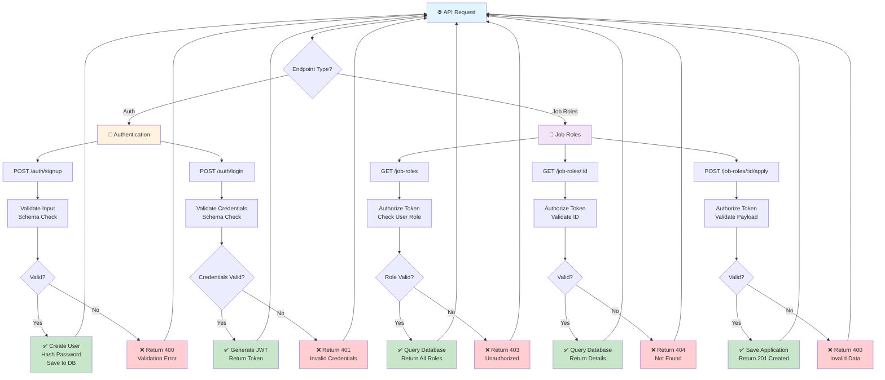

# Backend API Workflows

This diagram shows the main API workflows in the team1-backend. Use this as a reference when selecting API endpoints to test with Playwright.

## API Endpoints

### Authentication
- **POST /auth/signup** - Create new user account
  - Validates: email, password, name
  - Returns: User ID, created timestamp
  - Error: 400 (validation), 409 (duplicate email)

- **POST /auth/login** - Authenticate user and generate JWT
  - Validates: email, password
  - Returns: JWT token
  - Error: 401 (invalid credentials)

### Job Roles
- **GET /job-roles** - Retrieve all job roles (paginated)
  - Authorization: Admin, User
  - Returns: Array of job role objects
  - Error: 401 (missing token), 403 (invalid role)

- **GET /job-roles/:jobRoleId** - Get specific job role details
  - Authorization: Admin, User
  - Returns: Single job role object
  - Error: 401 (missing token), 403 (invalid role), 404 (not found)

- **POST /job-roles/:jobRoleId/apply** - Submit application for a job role
  - Authorization: Admin, User
  - Validates: application payload
  - Returns: Application ID, confirmation
  - Error: 400 (invalid payload), 401 (missing token), 403 (invalid role), 404 (not found)

## Test Coverage Recommendations

| Endpoint | Test Scenario | Priority |
|----------|---------------|----------|
| POST /auth/signup | Valid signup - user created | High |
| POST /auth/signup | Invalid input - validation error | High |
| POST /auth/signup | Duplicate email - conflict error | High |
| POST /auth/login | Valid credentials - JWT token returned | High |
| POST /auth/login | Invalid credentials - 401 error | High |
| GET /job-roles | Authenticated request - list returned | High |
| GET /job-roles | Missing auth token - 401 error | Medium |
| GET /job-roles/:id | Valid ID - details returned | High |
| GET /job-roles/:id | Invalid ID - 404 error | Medium |
| POST /job-roles/:id/apply | Valid application - 201 created | High |
| POST /job-roles/:id/apply | Invalid payload - 400 error | High |
| POST /job-roles/:id/apply | Unauthorized user - 403 error | Medium |

## Key Testing Points

### Authentication
- JWT token generation
- Token validation in requests
- Password hashing
- Duplicate email handling
- Invalid credential responses

### Authorization
- Role-based access control
- Token expiration
- Missing/invalid token handling
- Admin vs User permissions
- Protected route access

## Response Codes Reference

| Status Code | Meaning | Common Scenarios |
|------------|---------|-----------------|
| 200 | OK - Request successful | GET requests return data |
| 201 | Created - Resource created | POST /auth/signup, POST /apply |
| 400 | Bad Request - Invalid input | Failed validation, malformed payload |
| 401 | Unauthorized - Auth failed | Invalid credentials, missing token |
| 403 | Forbidden - No permission | Insufficient user role |
| 404 | Not Found - Resource missing | Invalid job role ID |
| 500 | Server Error - Internal error | Database connection issues |
