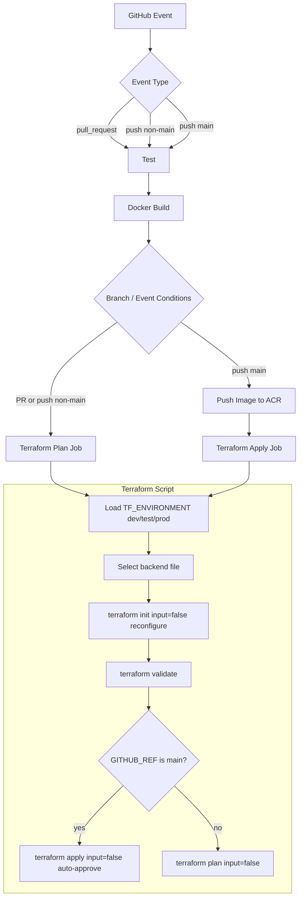

# Terraform and CD Pipeline HLD

This diagram shows the current CI/CD behavior:
- Pull requests and branch pushes run tests, docker build, and Terraform plan.
- Main branch pushes run tests, docker build, ACR push, then Terraform apply.
- Terraform runs non-interactively in both plan and apply modes.

## Save as Image in VS Code

1. Open this file in the editor.
2. Open Markdown Preview.
3. Use your Markdown preview export option or screenshot tool to save as PNG.

If your current setup does not show a direct export option, install a Markdown PDF extension and export this file to PDF/PNG from VS Code.
